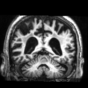
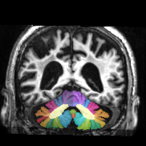
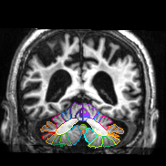

# Medical Image Segmentation Visualization

Show alpha-composition of an image slice and its corresponding label image.

  

Three modes are supported:

* Show only the image
* Show an alpha-composite of the image and its label image
* Show only the outer edges of each label region

Users can adjust:

* The intensity scales of the image
* The alpha value of the composition
* The edge width of the label image

Use [improc3d](https://gitlab.com/shan-utils/improc3d) to transform a brain image into its axial, coronal, and sagittal views.

See the [documentation](https://shan-utils.gitlab.io/segviz) for more details.
