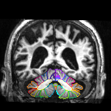

Examples
========

Use the command line tools
--------------------------

Convert NIfTI images:

.. code-block:: bash

   convert_nii -h # print help
   convert_nii -i image.nii.gz -l label.nii.gz -c colormap.txt -v coronal -o results -q -a 0.5 -A

Generate an HTML file of many segmentations:

.. code-block:: bash

   generate_html -h # print help
   generate_html -i list.csv -o html_dir

The input ``list.csv`` to ``generate_html`` should be formated as a .csv file:

.. code-block:: text

   name1,path/to/image1.nii.gz,path/to/label1.nii.gz
   name2,path/to/image2.nii.gz,path/to/label2.nii.gz
   name3,path/to/image3.nii.gz,path/to/label3.nii.gz

A screenshot of the generated web page:

.. image:: _static/screenshot.png

.. admonition:: Tips

   * Use ``shift + mouse wheel`` to scroll horizontally.
   * Use ``ctrl + mouse wheel`` to zoom in/out.

.. warning::

   ``generate_html`` calls ``convert_nii`` to generate the pictures. However,
   if a picture has already been generated, this command will skip it.
   Therefore, delete the old files if you want to generate new ones.

Run a web service:

.. code-block:: bash

   run_html -i html_dir

This page can be viewed at ``localhost:5000`` in a web browser. Or use ``ssh``
to bind the port to view remotely:

.. code-block:: bash

    ssh -L 5000:localhost:5000 server_address

Then the web page can be viewed **locally** at ``localhost:5000``.

Show only the image
-------------------

>>> from segviz import ImageRender
>>> renderer = ImageRender(image)
>>> print('The number of slices is', len(renderer))
>>> image_slice = renderer[100]

.. image:: _static/image.png

Show the overlay
----------------

>>> from segviz import ImagePairRender
>>> renderer = ImagePairRender(image, label_image, colors, alpha=0.5)
>>> image_slice_a0p5 = renderer[100]

.. image:: _static/pair.png

>>> renderer.alpha = 1
>>> image_slice_a1p0 = renderer[100]

Show region edges
-----------------

>>> from segviz import ImageEdgeRender
>>> renderer = ImageEdgeRender(image, label_image, colors, alpha=1, edge_width=1)
>>> image_slice_e1 = renderer[100]

>>> renderer.edge_width = 3
>>> image_slice_e3 = renderer[100]

Reorient the brain
------------------

>>> import nibabel as nib
>>> from improc3d import transform_to_axial, transform_to_sagittal, transform_to_coronal
>>> image_nib = nib.load('image.nii.gz')
>>> affine = image_nib.affine
>>> image = image_nib.get_fdata()
>>> label_image = nib.load('label.nii.gz')
>>> image_axial = transform_to_sagittal(image, affine, order=1)
>>> label_axial = transform_to_sagittal(label, affine, order=0)
>>> render = ImagePairRender(image_axial, label_axial, colors)
>>> render[100]

Load the colormap
-----------------

The colors file should be a ``.npy`` array or a ``.txt`` file with the following
format:

.. code-block:: text

   ################################################
   # ITK-SnAP Label Description File
   # File format:
   # IDX   -R-  -G-  -B-  -A--  VIS MSH  LABEL
   # Fields:
   #    IDX:   Zero-based index
   #    -R-:   Red color component (0..255)
   #    -G-:   Green color component (0..255)
   #    -B-:   Blue color component (0..255)
   #    -A-:   Label transparency (0.00 .. 1.00)
   #    VIS:   Label visibility (0 or 1)
   #    IDX:   Label mesh visibility (0 or 1)
   #  LABEL:   Label description
   ################################################
       0     0    0    0        0  0  0    "Clear Label"
      12   255  255  150        1  1  1    "Corpus medullare"
      33    88   95  255        1  1  1    "Left I-III"
      36    53   55  143        1  1  1    "Right I-III"

>>> from segviz import load_colors
>>> colors = load_colors('colormap.txt')

Get a default colormap
----------------------

.. doctest::

   >>> from segviz import get_default_colormap, append_alpha_column
   >>> colormap = append_alpha_column(get_default_colormap())
   >>> print(colormap)
   [[  0   0   0 255]
    [  0 120 177 255]
    [255 126  42 255]
    [  0 160  58 255]
    [223  35  45 255]
    [153 103 185 255]
    [144  86  76 255]
    [235 119 191 255]
    [127 127 127 255]
    [187 189  60 255]
    [  0 190 205 255]]
